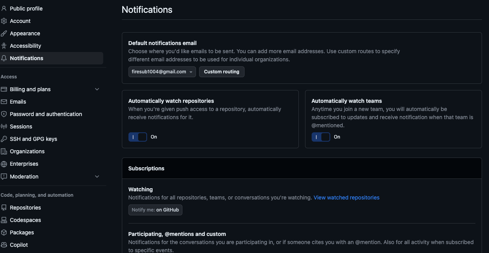
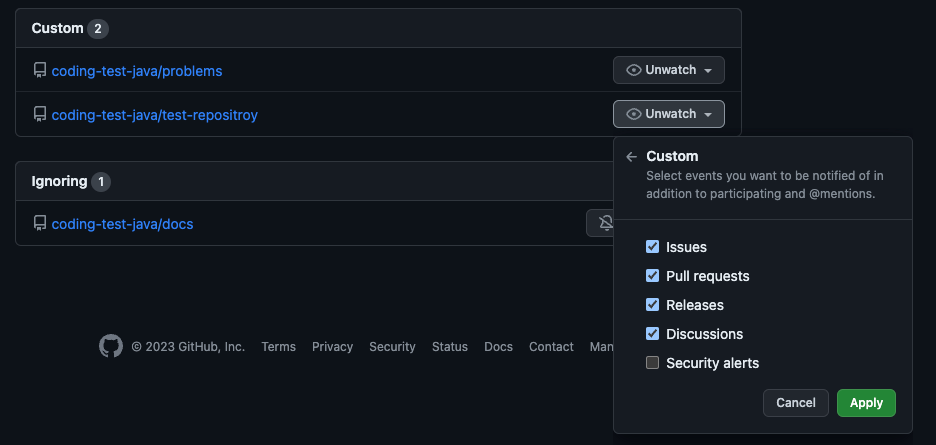
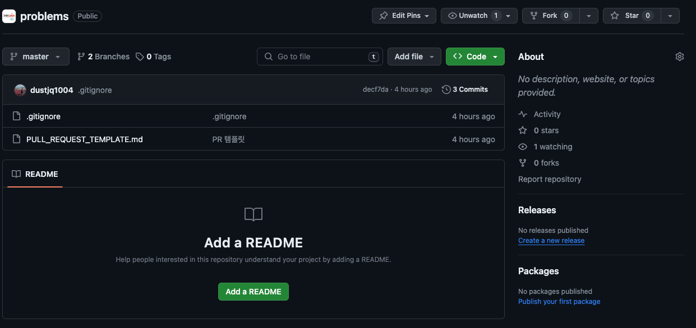
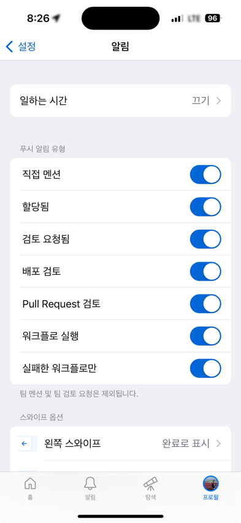

## Github Notification 이용하기
깃허브 알림을 사용하여 좀 더 효과적인 협업을 할 수 있다. 깃허브 알림을 사용하면 깃허브 활동에 대한 알림을 email로 받거나 모바일 푸쉬 알람을 받을 수 있다. 또한, Notification은 Repository 별로 설정도 가능하다.

깃허브 알림을 받으려면 몇 가지 설정이 필요하다.


### 1. 깃허브 웹사이트 설정
우선 깃허브 웹사이트에서 해야하는 설정이다.
#### -1. 오른쪽 위에 자신의 프로필 사진을 클릭하여 나오는 메뉴에서 Settings를 클릭한다.
#### -2. 왼쪽 사이드 메뉴중에 Notifications 메뉴를 클릭한다.


해당 페이지에서 Notifications에 대한 설정을 할 수 있다.
- Default notifications email : 알림을 받을 Repository와 email을 루팅을 설정할 수 있다.
- Automatically watch repositories : 푸시 엑세스 권한이 생기면 자동으로 알림을 받을 수 있게 한다.
- Subscriptions-Watching : 모든 Repositories, teams, or watching 상태인 repositories에 대한 설정이다.

#### -3. Watching 에서 ```View watched repositoreries``` 링크를 클릭한다.
#### -4. Watching 페이지에서 알림 받을 repository 알림을 설정한다.
- 알림은 Unwatch를 클릭하여 모든 활동에 대한 알림을 받을 것인지 아니먄 Custom하여 PR만 받을 것 인지 등 설정할 수 있다.



> 리포지토리에도 알림에 대한 Unwatch 설정 버튼이 있다.  
> 

### 2. 모바일 깃허브 설정

모바일 설정은 간단하다. 모바일 App에 접속해서 프로필 탭으로 이동하면 우측 상단에 설정 아이콘이 있다.
설정 페이지에서 알림에 대한 설정을 할 수 있다.



---
## 푸쉬 알림이 오는 깃허브 기능
- PR 검토자
- 작성한 PR에 리뷰가 달렸을 때
- @Mentions
- Assignees
- ~~discussions 과 이슈 생성은 알림이 쌓이긴 하지만 푸시 알람은 되지 않는다.~~
