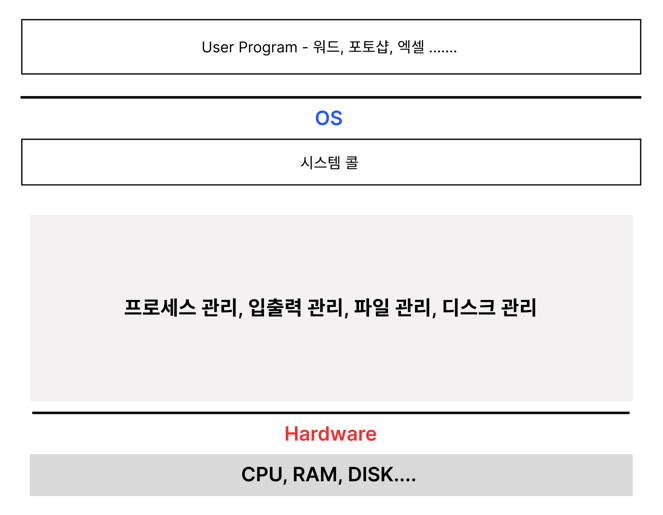

# 운영체제

이번 포스팅에선 운영체제에 대해 간략하게 알아본다.

## 운영체제란?

하드웨어 위에 설치되어 하드웨어 계층과 다른 소프트웨어 계층을 연결하는 소프트웨어이다.
운영체제에는 목적과 역할이 있다. 운영체제를 이해하기 위해서는 목적과 역할을 잘아야 한다.

- 시스템 자원 관리
- 사용자가 컴퓨터를 사용할 수 있는 환경을 제공

예) MacOs, Windows, Linux, Unix

## 운영체제의 역할

## 운영체제 역할1 : 시스템 자원(System Resource) 관리자

운영체제는 컴퓨터 하드웨어를 관리하는 소프트웨어이다. 사용자가 컴퓨터를 잘 사용하기 위해서는 한정된 자원을 효율적으로 문제가 없게 관리해야한다.
이러한 역할에 기반에 OS는 4가지 목적이 있다.  
OS 성능을 평가하는 기준으로 사용된다.

- 처리 능력(throughput) 향상 : 일정 시간 내에 시스템이 처리하는 일의 양을 향상
- 반환 시간(turnaround time) 단축 : 사용자가 요청한 작업을 완료할 때까지 소요되는 시간 단축
- 사용 가능도(availability) 향상 : 시스템 자원을 얼마나 빨리 제공하는 가를 의미.
- 신뢰도(reliability) 향상 : 시스템이 주어진 문제를 정확하게 푸는지를 의미

### 메모리 구조

- **CPU**

  cpu는 중앙처리장치로 프로그램을 실행하는 데 필요한 연산을 수행. 다른 말로 프로세서

- **메모리**

  데이터를 저장하기 위한 기억장치, 휘발성 메모리(주 기억장치), 비휘발성(보조 기억장치)가 있다.

  주 기억장치 → RAM

  보조 기억장치 → SSD, HHD

메모리는 **레지스터 > 캐시 > RAM > 하드 디스크** 순으로 빠르다.

- **레지스터** : CPU가 사용자 요청을 처리하는 데 필요한 데이터를 임시로 저장하는 기억장치
- **캐시 메모리** : CPU와 RAM 사이 속도 차이를 해결하기 위한 기억장치. CPU 내부에 위치한다.
- **RAM** : 컴퓨터에서 프로그램을 실행할 때 필요한 정보를 저장. 휘발성
- **하드 디스크** : 사용자 필요한 데이터와 프로그램을 저장, 비휘발성

OS는 디스크에 있는 프로그램을 메모리로 로드한다. 로드한 프로그램을 프로세스라고 하고, CPU가 처리하게 된다. CPU는 하나의 프로세스만 처리 가능해서 멀티 프로세스 환경에서는 OS가 스케쥴링 하여 프로세스를 관리한다.

## 운영체제 역할2: 컴퓨터 하드웨어와 프로그램을 제어

### 커널과 시스템 콜

**커널이란?**  
커널은 OS의 핵심 요소로, 컴퓨터 하드웨어와 프로세스의 보안, 자원 관리, 하드웨어 추상화 같은 중요한 역할을 수행한다. 
특히 자원 관리를 위해 CPU 스케줄링, 메모리 관리, 입출력 관리, 파일 시스템 관리 등의 업무를 수행한다.
위에 그림을 보면 OS영역에 시스템콜과 하드웨어 사이가 커널이다.

### 커널 모드, 사용자 모드

사용자 접근 제한을 하기 위해 운영체제는 커널 모드, 사용자 모드 두 개로 분리해 관리한다.

- 커널 모드 : 하드웨어에 직접 접근해 메모리, CPU와 같은 자원을 사용
- 사용자 모드 : 사용자 모드는 커널에 접근할 수 없다. 커널에 접근하기 위해서는 시스템 콜을 호출해 커널 모드에 진입해야 한다.
- 시스템 콜 : 커널 모드에 접근할 수 있게 하는 시스템 함수이다. 시스템 콜의 대표적인 예는 fork(), wait()이 있다.

커널 모드와 사용자 모드를 나눈 이유는 커널의 역할을 생각하면 되는데, 보안 목적과 시스템 자원을 사용자와 분리해 효율적으로 관리하기 위해서이다.

## 운영체제 역할3 : 사용자와 컴퓨터간의 커뮤니케이션 지원

운영체제는 사용자(UI) 하드웨어 사이에 존재하며 사용자와 컴퓨터간의 커뮤니케이션 역할을 하게 된다. 다른 자원을 관리하고, 프로그램을 제어하는 등 여러가지 역할이 있지만 결국 사용자가 컴퓨터를 편리하게 사용할 수 있게 목적을 둔다.

---
## 출처
- 기술 면접 대기 CS 전공 핵심요약집 (책)
- 패스트 캠퍼스 강의
