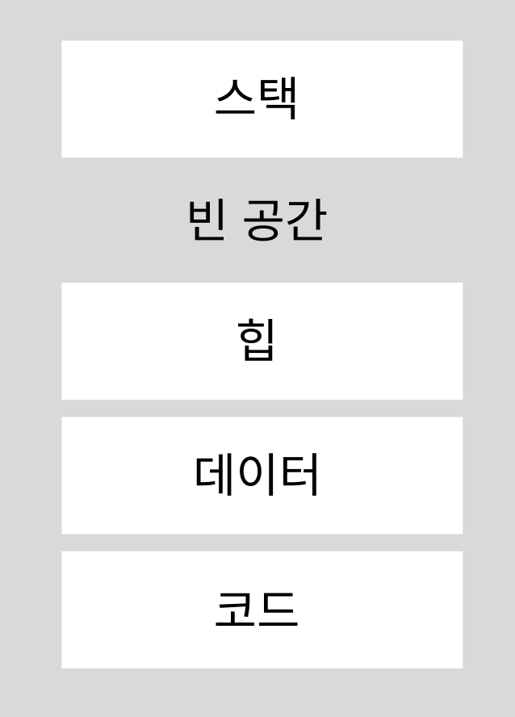

# 프로세스

프로세스는 컴퓨터에서 실행 중인 하나의 프로그램을 의미한다. 프로그램은 특정 작업을 수행하기 위한 명령어의 집합이다. 프로세스는 OS로 부터 할당된 메모리 영역(코드, 데이터, 스택, 힙)을 사용하여 작업을 처리한다. 할당된 메모리 영역은 다른 프로세스가 접근할 수 없는 독립된 영역이다.


프로세스의 구조에는 stack, heap, data, code 영역이 있다. code는 작성된 소스코드가 컴파일 되어서 code 영역에 저장 된다. data 영역은 글로벌 변수들이 저장되고, stack에는 함수 또는 지역변수들이 stack에 저장된다.

- PCB는 운영체제 영역에 있다.

### 프로세스 메모리 영역 구조



**주소 값은 상단 (높은 주소) → 하단 (낮은 주소)이다.**

- 스택 : 지역 변수, 함수의 매개변수, 반환되는 주소 값 등이 저장되는 영역, 높은 주소 → 낮은 주소로 값을 할당한다. 영역 크기는 컴파일 때 결정된다.
- 힙 : 사용자에 의해 동적 메모리 할당이 일어나는 영역. C 언에서 malloc()으로 할당. 힙은 반대로 낮은 주소에서 높은 주소 값으로 메모리가 할당된다. 영역 크기는 런타임에 결정.
- 데이터 : 전역 변수, 정적 변수, 배열, 구조체가 저장되는 영역, 세부적으로 BSS(Block Stated Symbol)영역과 데이터 영역으로 나뉜다. BSS는 초기화되지 않은 변수를 저장한다.
- 코드 : 실행할 코드가 기계어로 컴파일되어 저장

스택과 힙 영역에서 빈공간이 없어지면 스택오버 또는 힙 오버플로우가 에러가 난다.

> 오버 플로우에 반대되는 용어인 언더 플로우가 있고, 언더 플로우는 공간에서 할당할 수 있는 최소 범위보다 작은 것을 의미한다.
>

### 쓰레드

프로세스는 한 개 이상의 스레드를 갖는다. 쓰레드는 프로세스에서 실제로 실행되는 흐름의 단위이다. 프로세스 안에 존재하는 쓰레드는 프로세스의 메모리 공간을 이용하고, 지역 변수를 저장하는 스택 영역을 할당받는다.

그리고 쓰레드는 다른 쓰레드와 공유할 수 있는 역역이 있는데 바로 힙 영역(전역 변수)이다.


#### 사용자 레벨 쓰레드, 커널 레벨 쓰레드  
쓰레드도 커널 모드와 사용자 모드 처럼 관리하는 주체에 따라 나뉜다. **사용자 레벨 쓰레드**는 사용자가 라이브러리를 이용해 생성 및 관리하고, **커널 레벨 쓰레드**는 커널이 쓰레드를 생성 및 관리한다.
 
<br/>
사용자 레벨 쓰리드와 커널 레벨 쓰레드는 다음과 같이 3가지 관계를 맺는다.
#### 1. 다대일 모델  
사용자 레벨 n개에 커널 레벨 1개가 매핑
하나의 사용자 레벨 쓰레드가 커널 레벨 쓰레드를 호출하면 다른 쓰레드는 그동안 사용을 하지 못한다.
- 스레드 관리는 사용자 공간에 스레드 라이브러리에 의해 행해진다.

- 장점
    1. 커널 모드를 호출할 때 이벤트 콜이 발생해서 오버헤드가 발생하는데 커널모드가 하나이기 때문에  사용자 스레드 생성 및 관리에 대한 오버헤드가 줄어든다.
    2. 스레드 간의 통신 및 동기화가 간단해진다.
- 단점
    1. 하나의 커널 레벨 스레드에 의해 처리 되어 사용자 레벨 스레드의 응답시간이 빠르지만, 커널 레벨 스레드에 발생하는 부하나 병목현상으로 인해 느려질 수 있다.
    2. 커널 스레드 하나에 문제가 발생하면 해당 스레드와 관련된 모든 사용자 스레드가 영향을 받을 수 있다.

#### 2. 일대일 모델
사용자 레벨 쓰레드 하나당 커널 레벨 쓰레드 하나가 할당된다.

- 장점
    1. 각각의 사용자 스레드가 별도의 커널 스레드에 매핑되므로 병렬 처리가 가능하다.
    2. 안정성이 높고 예측 가능한 동작을 보장한다.
    3. 구현이 간단하다.
- 단점
    1. 스레드 생성 및 관리에 대한 오버헤드가 발생할 수 있다.
    2. 너무 많은 스레드를 생성할 경우, 시스템 리소스를 낭비할 수 있다.

#### 3. 다대다 모델
사용자 레벨 쓰레드 n개와 커널 모드 쓰레드 m개가 매핑. 1번과 2번의 단점을 보완한 모델이지만,
구현이 어렵다는 단점이 있다.

- 장점
    1. 병렬 처리가 가능하며, 스레드 간의 통신과 동기화가 유연하게 이루어진다.
    2. 시스템 리소스를 효율적으로 활용할 수 있다.
- 단점
    1. 구현 및 관리가 복잡하며, 오버헤드가 발생할 수 있다.
    2. 스레드 간의 스케줄링 및 동기화가 관리하기 어려울 수 있다.

### PCB

OS가 프로세스를 제어하기 위한 프로세스 정보를 저장하는 공간.

PCB - 현재 상태, PID, 부모 PID, 자식 PID, PC(다음 실행할 명령어 주소), 프로세스 우선순위, 메모리 제한 등을 저장한다.

### 프로세스 생성과 종료

프로세스는 기존 프로세스에서 fork() 함수를 통해 생성 가능하다. fork() 함수는 호출한 프로세스를 복사하는 기능이 있다. 기존 프로세스는 부모 프로세스가 되고 복사된 프로세스는 자식 프로세스라 일컫는다.

fork()를 하게 되면 부모프로세스는 자식 프로세스의 PID값을 리턴하고, 자식 프로세스는 0을 리턴한다.

```jsx
#include <stdio.h>
#include <unistd.h>
#include <sys/types.h>

int main() {
    pid_t pid;
    int x = 0;
    
    pid = fork();
    
    if(pid > 0) {  // 부모 코드
        x = 1;
    }
    else if(pid == 0){  // 자식 코드
        x = 2;
    }
    else {  // fork 실패
        return -1;
    }
    printf("PID : %ld, x : %d\n",(long)getpid(), x);
    return 0;
}
```

다음 과 같은 C언어 코드가 있을 때 fork() 후 반환 값을 확인하면 pid에 따라서 다른 처리를 할 수 있는 것을 볼 수 있다.

프로세스 종료는 다음과 같이 여러 경우를 볼 수 있다.

- exit() 호출을 통한 정상 종료
- 실행 시간 또는 특정 이벤트 대기 시간 초과
- 파일 검색 입출력에 실패
- 오류 발생 및 메모리 부족

<br/>
부모 프로세스는 자식 프로세스가 할당된 자원을 초과하거나 자식 프로세스에 할당된 작업이 없을 때 종료 시킬 수 있다.

### 프로세스 상태도

OS가 프로세스를 관리하기 위해 프로세스를 상태 정보를 저장한다. 생명주기라고도 할 수 있다.

프로세스의 상태는 **생성, 준비, 대기, 실행, 종료**가 있다.

- **생성** : 프로세스가 PCB를 가지고, OS 승인을 받기 전
- **준비** : OS로부터 승인 받고 준비 큐에 대기
- **실행** : CPU를 할당받고 실행
- **대기** : 시스템 콜 또는 입출력 이벤트가 발생하여 대기 상태
- **종료** : 프로세스 종료

#### 프로세스 상태 변화
1. 생성 → 준비 :  OS승인을 받아서 준비 큐에 올라감.
2. 준비 → 실행 :  준비 큐에 있는 프로세스 중 우선순위가 높은 프로세스가 디스패치 되어 CPU에 올라감.
3. 실행 → 준비 :  CPU에 독점 방지를 위해 timeout 된 프로세스를 인터럽트 요청하여 준비 상태로 변경
    1. 예외 사항일 때  - 선점형 스케줄링
4. 실행 → 대기 : 입출력이나 이벤트를 위해 인터럽트 요청하여 대기 상태가 된다.
    1. 입출력이나 이벤트 - 파일 요청 등
5. 실행 → 종료 : 프로세스 실행 종료
6. 대기 → 준비 : 입출력이나 이벤트가 완료되어 준비 상태로 변경

> **디스패치** : 프로세스에 CPU 자원을 할당해 해당 프로세스가 준비 상태에서 실행 상태가 되는 것을 의미한다.  
> **인터럽트** : 입출력이나 컨텍스트 스위칭이 일어날 수 있는 경우(프로세스 Timeout), 예외 상황과 같은 중요한 처리를 인터럽트라고 한다.

### 멀티 프로세스, 멀티 쓰레드

**멀티 프로세스**

응용 프로그램 하나를 여러 프로세스로 구성하는 것을 의미

- 한 프로세스가 죽어도 다른 프로세스에 영향이 없다.
- 시간과 메모리 공간을 많이 사용한다.
- CPU는 하나의 작업만 처리 가능하다. 그렇기 때문에 여러 프로세스를 처리하려면 CPU에서 콘텍스트 스위칭 작업을 통해 프로세스를 교체해야한다.
- 콘텍스트 스위칭 작업에서 시간과 메모리를 사용하게 되고, 이를 오버헤드라고 한다.
- 프로세스는 IPC를 통해 프로세스 간에 자원을 공유할 수 있다.

<br/>
**멀티 쓰레드**

쓰레드를 여러 개 생성해 쓰레드들이 각자 다른 작업을 처리하도록 한다.

- 쓰레드 간에 힙, 데이터, 코드 영역을 공유한다.
- 콘텍스트 스위칭할 때 오버헤드가 적게 든다.
- IPC 미사용으로 멀티 프로세스의 단점을 보완한다.
- 프로세스를 여러 개 생성하는 것보다 효율이 좋다.
- 자원을 다른 쓰레드와 공유하기 때문에 공유 자원에 대한 동기화가 필요하다.

> **동시성과 병렬성**  
> **동시성**은 하나의 코어에서 여러 작업을 번갈아 가면서 처리하는 방식  
> **병렬성**은 CPU가 멀티 코어에 있어서 CPU가 각 작업을 동시에 처리하는 방식

---
### 출처
기술 면접 대기 CS 전공 핵심요약집 (책)
