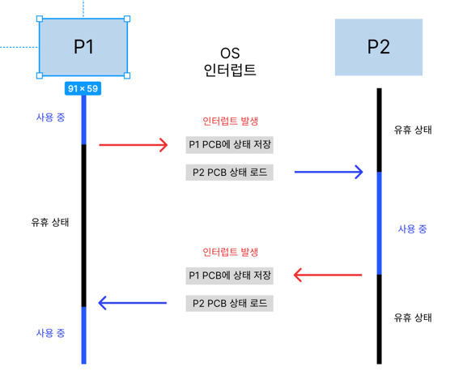

이전 글에서는 기본적인 프로세스의 개념을 배웠다면 이번에는 조금 심화된 내용이다. 이전 글에서 볼 수 있던 여러 문제점들을 해결할 수 있는 쓰레드 동기화, 교착 상태, 쓰레드 안전, 프로세스 통신 방식인 IPC 등에 대에서 알 수 있다.

### 콘텍스트 스위칭

콘텍스트 스위칭은 인터럽트에 의해서 일어난다. 인터럽트란 입출력 관련 이벤트 또는 예외 상황이 발생할 때 이에 대응할 수 있게 CPU에 처리를 요청하는 것이다. 인터럽트는 입출력, CPU 사용 시간 만료, 자식 프로생성을 생성할 때 발생한다.

이전 글에서도 말했듯이 CPU는 하나의 프로세스만 처리할 수 있다. 그렇기 때문에 다른 프로세스를 실행하려면 인터럽트를 발생시키고, 콘텍스트 스위칭이 이루어져야 한다. 여기서 콘텍스트는 CPU가 처리하는 프로세스의 정보를 의미한다. 즉, 멀티 프로세스 환경에서 CPU가 처리 중인 프로세스의 정보를 바꾸는 것이 콘텍스트 스위칭이다.

### 콘텍스트 스위칭 과정



1. P1이 CPU 사용 중일 때 인터럽트 발생
2. P1 PCB에 상태 저장
3. P2 PCB에서 상태 로드, P2 CPU 사용 중
4. P2 인터럽트 발생
5. P2 PCB에 상태 저장
6. P1 PCB에서 상태 로드

위 과정에서 추가적으로 1~2, 5~6 과정에서는 P2가 유휴 상태(idle)상태가 되고, 전 과정에서 P1은 유휴 상태가 된다. 그리고 2~3과정에서는 P1, P2 유휴 상태이고, CPU는 아무 일도 못하게 된다. 이러한 시간과 메모리가 소요될 때를 **오버헤드**라고 한다.

> **멀티 쓰레드**를 처리할 때도 콘텍스트 스위칭이 일어난다. 하지만 프로레스보다 메모리 사용과 시간 소요가 많이 적다.
>

### 프로그램 카운터, 스택 포인터

**프로그램 카운터**는 프로세스가 이어서 처리해야 하는 명령어의 주소 값이다.

**스택 포인터**는 스택 영역에서 데이터가 채워진 가장 높은 주소 값이다.

- 프로그램 카운터와 스택 포인터가 있어서 CPU는 이전에 실행하던 코드를 이어서 실행할 수 있다.

### 프로세스 동기화

**경쟁 상태**  - 프로세스 또는 쓰레드에서 하나의 공유 자원에 접근 할 때 접근 순서에 따라 결과 값이 달라 지는 경우를 경쟁 상태라고 한다.

```jsx
public static void main(String[] args) {
		int n = 0;
		increase(number);
		increase(number);
}

public void int increase(int number) {
		number++;
		System.out.println(number);
}
```

`number`라는 변수를 증가시키는 함수가 있다고 하자. 원래의 정상적인 출력 값을 생각하면 1, 2가 될 것이다. 하지만 만약에 동기화가 이뤄지지 않는다면 1, 1이 출력 된다.

### 임계 영역

공유 자원에 접근할 수 있고 접근 순서에 따라 달라지는 코드 영역을 임계 영역이라고 한다. 임계 영역에서 경쟁 상태를 방지하려면 여러 프로세스가 공아 자원에 접근해도 데이터의 일관성이 유지되도록 동기화를 해야 한다.

다음 3가지 조건을 충족하면 방지할 수 있다.

1. **상호배제 기법(mutual exclusive) :** 프로세스가 임계 영역을 사용 중일 때 다른 프로세스가 접근할 수 없게 한다. 뮤텍스와 세마포어 기법이 있다.
2. **진행(progress)** : 임계 영역을 실행 중인 프로세스가 없을 때 다른 프로세스가 임계 영역을 실행한다.
3. **한정된 대기(bounded waiting)** : 임계 영역 접근 요청 후 대기일 때 무한정 대기하지 않게 한다.

### 뮤텍스

뮤텍스는 락을 가진 프로세스만 접근할 수 있게 하는 기법이다. 임계 영역에 먼저 접근한 프로세스가 락을 걸면 다른 프로세스들은 해당 프로세스가 락을 해제하기 전까지 대기한다. 락킹 매커니즘이라고도 한다.

접근하지 못한 프로세스는 락을 얻기 위해 기다리는 동안 반복문을 돌면서 확인한다. 이러한 행동을 스핀락이라고도 한다.

> **스핀락** : 락을 얻기 위해 프로세스가 반복문을 돌면서 기다리는 것을 의미
>

### 세마포어

공유 자원에 접근할 수 있는 프로세스의 수를 정해 접근을 제어하는 기법이다. 한마디로 락을 여러개 두는 것이다. 그리고 저근한 프로세스가 해제를 하면 다른 프로세스가 접근할 수 있도록 신호를 보낸다. 그래서 시그널링 메커니즘이라고도 한다.

### 동기, 비동기, 블로킹, 넌블로킹

동기와 비동기, 블로킹과 넌블로킹은 헷갈리기 쉬운 개념이다. 개념을 잘 알아두고 잘 구분해야한다.

- **동기** : 여러 작업을 처리할 때 작업 순서를 보장
- **비동기** : 여러 작업을 처리할 때 순서를 보장하지 않음
- **블로킹** : 작업을 수행할 때 대기할 수 있다는 것을 의미 작업 순서를 보장하지 않음
- **넌블로킹** : 작업을 시작하면 대기 없이 수행한다는 것을 의미

### 교착 상태

상호배제 기법으로 인해 2개 이상의 프로세스가 서로의 자원을 요구하며 기다리는 상태를 교착 상태라고 한다. 교착 상태는 4가지 조건이 채워지면 발생한다.

- **상호배제(mutual exclusion**) : 하나의 공유 자원에 하나의 프로세스만 접근 가능
- **점유와 대기(hold and wait)** : 프로세스가 최소 하나의 자원을 점유하고 있는 상태에서 추가로 다른 프로세스에서 사용 중인 자원을 점유하기 위해 대기
- **비선점(non-preemption)** : 다른 프로세스에 할당된 자원을 뺏을 수 없다.
- **환형 대기(circular wait)** : 프로세스가 자신의 자원을 점유하면서 앞이나 뒤에 있는 프로세스의 자원을 요구

교착 상태를 방지하려면 4가지 조건 중 한 가지만 제거하면 된다.

### 쓰레드 안전

쓰레드 안점은 멀티 쓰레드 환경에서 하나의 변수, 함수, 객체제 쓰레드 여러 개가 동시에 접근해도 문제가 없음을 의미 한다. 쓰레드가 안전하지 않은 경우는 위에 프로세스에서 봤던 동기화가 이루어지지 않았을 경우와 똑같다.

쓰레드가 동시에 접근했을 때 예상하지 못한 결과가 나왔을 때 쓰레드가 안전하지 않은 경우이다.

<br/>
**쓰레드가 안전하기 위해서는?**

쓰레드는 다음과 같은 조건이 있다.

- 상호배제 : 공유 자원에 접근해야 할 때 뮤텍스 또는 세마포어와 같은 기법을 사용해 접근을 통제한다.
- 원자 연산 (atomic operation) : 공유 자원에 접근할 때 원자 연산을 이용하거나 원자적으로 정의된 연산을 이용해 연산 도중에 다른 쓰레드가 접근할 수 없게 한다.
- 재진입성(reenrancy) : 특정 함수를 하나의 쓰레드에서 실행 중일 때 다른 쓰레드가 해당 함수를 실행해도 각 쓰레드에 올바른 결과가 나올 수 있게 한다.
- 쓰레드 지역 저장소(thread local storage) : 각 쓰렏에서만 접근할 수 있는 저장소를 사용해서 공유되는 자원을 줄인다.

### IPC

IPC는 Inter Process Communication의 약자로, 프로세스 간에 자원을 공유하는 방식이다. 공유하는 방식은 여러가지가 있다.

**공유 메모리(shared memory)**

공유 자원을 통해 프로세스 간에 자원을 공유하는 방식이다. 동기화 문제가 발생할 수 있다.

**소켓(socket)**

네트워크 소켓을 이용하는 프로세스 간 통신으로, 외부 시스템과도 이용할 수 있다. Client-Server 구조로 자원을 주고받는다.

**세마포어(semaphore)**

접근하는 프로세스를 제어해 공유 자원을 관리한다.

**파이프(pipe)**

FIFO 형태의 메모리인 파이프를 이요해 프로세스 간 자원을 공유하는 방식이다. 파이프는 단방향 통신으로 읽기 또는 쓰기 중 하나만 할 수 있다. 따라서 양방향 통신을 하려면 읽기와 쓰기 파이브를 각각 생성해야 한다.

**메시지 큐(message queue)**

FIFO 형태의 큐 자로구조를 사용해 프로세스간 메시지를 주고받는다.

### 좀비 프로세스과 고아 프로세스

자식 프로세스가 종료됐지만 부모 프로세스가 자식 프로세스의 종료 상태를 회수하지 않았을 경우에 남겨진 자식 프로세스를 좀비 프로세스라고 한다.

자식 프로세가 종료될 때 부모 프로세스에 **SIGHLD**라는 시그널을 보내면 부모 프로세스에서 `wait()` 함수를 호출해 자식 프로세스의 상태 정보를 받고 자원을 회수한다. 이때 자원 회수에 실패하면 좀비 프로세스가 생기게 된다.

- 좀비 프로세스는 자원을 낭비하게 한다.

<br/>
고아 프로세스는 부모 프로세스가 자식 프로세스보다 먼저 종료되는 경우에 자식 프로세스를 고아 프로세스라고 한다. 자식 프로세스의 부모 PID를 init 프로세스의 PID인 1로 바꿔 준다. 이렇게 하면 고아 프로세스의 부모 프로세스는 init프로세스가 된다. 이후에 고아 프로세스가 작업을 종료하면 init 프로세스가 고아 프로세스의 자원을 회수에 좀비 프로세스가 되는 것을 방지할 수 있다.

---
### 출처
기술 면접 대기 CS 전공 핵심요약집 (책)
