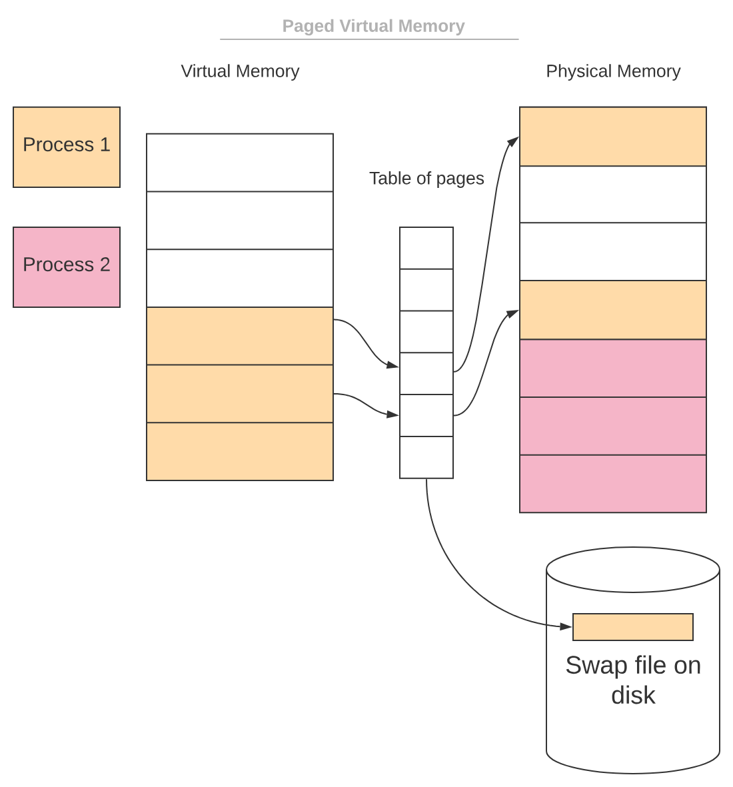

## 가상 메모리
가상 메모리란 프로그램이 혼자 메모리를 사용하는 것처럼 메모리를 가상화한 것을 말한다.

현재 운영체제에서는 적은 양의 RAM으로 방대한 양의 여러 프로그램들을 실행할 수 있다. 이것을 가능하게 해주는 것이 바로 가상 메모리 기법이다.
가상 메모리는 메모리 영역을 논리 메모리라는 하나의 영역으로 추상화해서 사용자들이 큰 메모리 영역을 사용하는 것처럼 보이게 만드는 메모리 관리 기법 중 하나다.
어떻게 가상 메모리 기법이 가능한지 좀 더 자세히 알아보기 위해서는 논리, 물리 메모리를 알아야한다.

### 논리 메모리, 물리 메모리

프로세스는 논리 메모리 영역만 바라본다. 그리고 논리 메모리에서 실제 물리 메모리 영역 주소를 찾아 실제 값에 접근한다.
즉, 프로세스가 보는 메모리 영역을 **논리 메모리 영역**, 실제로 사용되는 메모리 영역을 **물리 메모리 영역**이라고 한다.  

그리고 논리 주소를 물리 주소로 바꿔주는 장치가 바로 MMU(메모리 관리 장치)이다.  
CPU는 논리 주소만을 알고 해당 주소로 접근을 하면 MMU가 실제 메모리 주소로 변환하고, 값을 가져오게 된다. (DAT : 동적 주소 변환)  
이렇게 하면 CPU는 물리 메모리를 알지 못해도 프로그램에 필요한 메모리를 사용할 수 있게 된다.  

[이미지 출처](https://www.baeldung.com/cs/virtual-memory)

**장점**

- 실제 물리적인 주 기억장치보다 많은 기억장치를 사용할 수 있도록 하는 것
- 독릭적인 메모리 공간을 갖게 하여 각 프로세스든 다른 프로세스의 메모리 영역에 접근할 수 없고, 메모리 간의 충돌이 발생하지 않는다.
- 운영체제가 물리 메모리를 더 효율적으로 관리할 수 있다.

### 연속 메모리 할당

멀티 프로세스 환경에서 여러 프로세스를 메모리에 연속적으로 로드하는 방법이다.

**고정 분할 방식**과 **가변 분할 방식**이 있다.

### 고정 분할 방식

고정 분할은 메모리 영역을 분할한 뒤 각 영역에 프로세스를 할당하는 방식이다.
분할된 크기가 고정되기 때문에 메모리 올릴 수 있는 프로세스 수와 크기가 제한되고, 단편화 문제가 발생한다.

> **단편화란?**  
>단편화는 내부 단편화, 외부 단편화가 있는데 분할된 고정 크기가 8MB로 분할 되었을 때
>
>프로세스 1 = 8MB  
>프로세스 2 = 2MB  
>프로세스 3 = 6MB  
>
>각 프로세스는 할당이 되면, 2는 8MB에 못미치기 때문에 2~3 사이에 공간이 생기게 된다.
>이를 **내부 단편화**라고 한다.  그리고 8MB 크기에 프로세스 4가 할당된다고 할 때 남아있는 공간은 8MB이지만 나눠져 있기 때문에 할당할 수 없다. 이를 **외부 단편화**라고 한다.
>

### 가변 분할 방식

가변 분할은 할당할 프로세스의 크기에 따라 메모리 공간을 분할하는 방식이다.
가변 분할 방식 메모리 할당 알고리즘은 **최초 적합, 최적 적합, 최악 적합** 등이 있다.

1. **최초 적합 (first-fit)**

   메모리 공간에 프로세스 크기만큼 비어 있는 메모리 공간을 찾아 순서대로 프로세스에 할당한다.

2. **최적 적합 (best-fit)**

   프로세스를 할당할 때 들어갈 수 있는 메모리 공간 중 가장 작은 공간에 할당한다.

3. **최악 적합 (worst-fit)**

   최적 적합과 반대로 메모리 공간 중 가장 큰 공간에 할당한다.

### 비연속 메모리 할당

비연속 메모리 할당은 프로세스의 메모리를 나눠서 메모리 공간에 저장하는 방식이다.

**페이징**과 **세그멘테이션**이 있다.

### 페이징

페이징이란, 주소공간을 일정한 크기로 블록을 나누어서 운용하는 기법이다.
일정한 크기로 나눈 블록을 페이지라 한다. 그리고 페이지와 동일한 크기로 나눈 실제 기억 공간을 프레임이라한다.
페이지와, 프레임을 가지고 메모리 관리를 하는 기법이다.

- 매핑은 페이지 테이블을 이용한다. 페이지 테이블에 프로세스의 페이지 정보와 페이지에 매핑하는 프레임의 주소 값을 저장한다. 
- 페이지 테이블은 PCB에 저장된다.  

**장점**

물리 메모리에 연속으로 할당할 필요가 없어 외부 단편화 문제를 해결할 수 있다.

**단점**

페이지 수로 나누어 떨어지는지는 보장하지 않는다. 그래서 내부 단편화 문제가 발생할 수 있다.

### 세그먼테이션

프로세스의 메모리 영역을 논리적 단위인 세그먼트로 분할해 메모리를 할당한다.
논리적인 단위는 코드, 전역 변수, 힙, 스택 등으로 나눌 수 있다.

- 세그멘테이션도 테이블을 사용해 세그먼트의 논리 주소를 물리 주소로 매핑한다.
- 세그먼트 테이블에서 세그먼트들이 차지하는 크기가 다르다. 그렇기 때문에 실제 메모리 위치 정보 base와 세그먼트 길이인 limit을 저장한다.

 
**장점**

프로세스의 메모리 영역을 논리적 단위로 나눠 저장하므로 단위별로 데이터를 보호하기 쉽다는 장점이 있다.  
내부 단편화 문제를 해결한다.

 
**단점**

세그먼트의 크기가 균등하지 않아 프로세스의 할당/해제를 반복하는 과정에서 외부 단편화 문제가 생길 수 있다.
스택 세그먼트 영역에서 오버플로가 발생하면 다른 프로세스와 메모리 영역이 겹칠 수 있다.
그래서 다른 프로세스의 세그먼트나 스택 오버플로가 발생한 세그먼트를 디스크로 스왑 아웃해야 한다.

---
## 출처
- 기술 면접 대기 CS 전공 핵심요약집 (책)
- 패스트캠퍼스 강의
